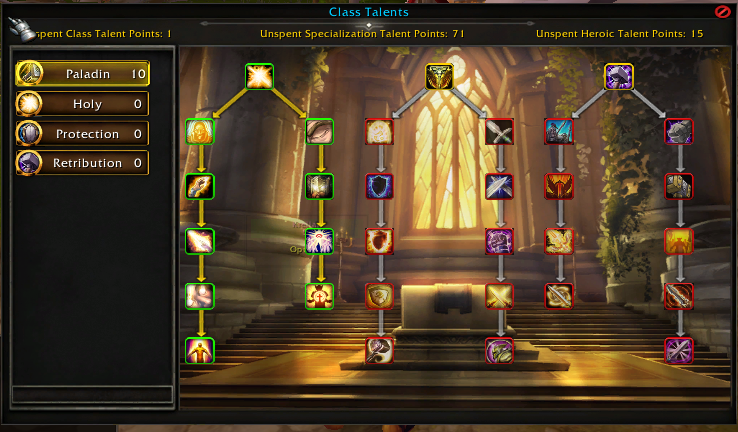
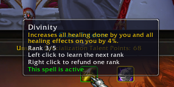
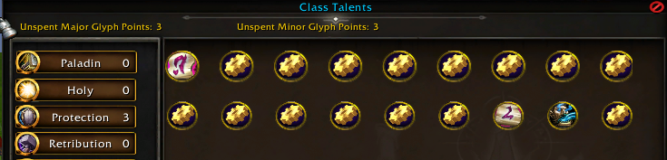
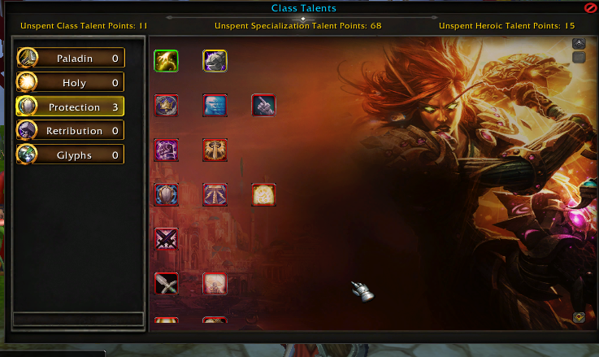

# Custom Talent Tree — AIO


This project is a continuation of [Custom Talent Tree — AIO](https://www.wowmodding.net/files/file/369-custom-talent-tree-aio/).

All credit for the original work goes to **Atraxian and awjerfaoiwejfoiajwe**. My contributions expand and complete parts of the existing system, with the assist of AI.



## Requirements

All spells used by the system must be visible in the spellbook for it to function correctly. This requires HEAVY edits to spell.dbc. Simply removing bitmask 128 from the talent spells will allow them to appear in your spellbook.

Replace the example IDs with your talent spell IDs. This removes bitmask 128 while preserving other flags, only when `Attributes > 128`.

```sql
UPDATE `db_spell_12340`
SET `Attributes` = `Attributes` & 4294967167
WHERE `Attributes` > 128
  AND (`Attributes` & 128) = 128
  AND `id` IN (
      12345, 12346, 12347
  );
```
Then just update your spell.dbc with the changes. All talents should then appear within your spellbook!

## Changes

### Database Integration

- Converted the system to use database tables.
- Added a dedicated table for talent ranks.
- Added a dedicated table for glyphs.
- Added `felskorn_talent_builds` and `felskorn_talent_build_spells` to track the active specialization and its learned spells.
- Populated talents for all classes.



### Talent Progression and Points

- Added separate progression rules for talent tabs.
- Class talents use sequential progression: learning a talent unlocks the next row.
- Added rank support for the Specialization tab.
- Specialization progression follows the standard talent-tree model, requiring five points per row to unlock the next.
- Added point allocation based on player level and tab. At level 60, players receive:
  - **11 Class points**
  - **71 Specialization points**
  - **15 Heroic points**
- Blocked purchases that would exceed the available point budget.
- Added automatic correction of over-budget builds on login, level changes, and specialization switching.

### Glyphs

- Added a Glyphs tab.
- Added item requirements for learning glyphs.
- Added support for glyph-tab backgrounds.
- Added circular glyph visuals.



### Interface and Specializations

- Added Main and Secondary specialization support.
- Fixed an issue where disabling a tab prevented tabs with higher IDs from appearing.
- Fixed an issue where disabled tabs occupied menu slots, leaving blank gaps.

## Setup and Customization

You can rename the `felskorn` references in the Lua scripts and database tables to match your server. Update these references consistently across both.

Base class talents are populated, but the General Class, Heroic, and Glyphs tabs still require configuration.



The Mage setup was created by Atraxian as an example. The Paladin setup was created as an additional example for this version. **The Paladin Fire tab is disabled by default.**

## Testing Status

This project has not yet undergone thorough testing. Further testing and configuration are recommended before using it on a live server. No support will be given, as we've(Felskorn) use a updated and more stable version of this.

[](https://youtu.be/oxDrn_6y7z8)
